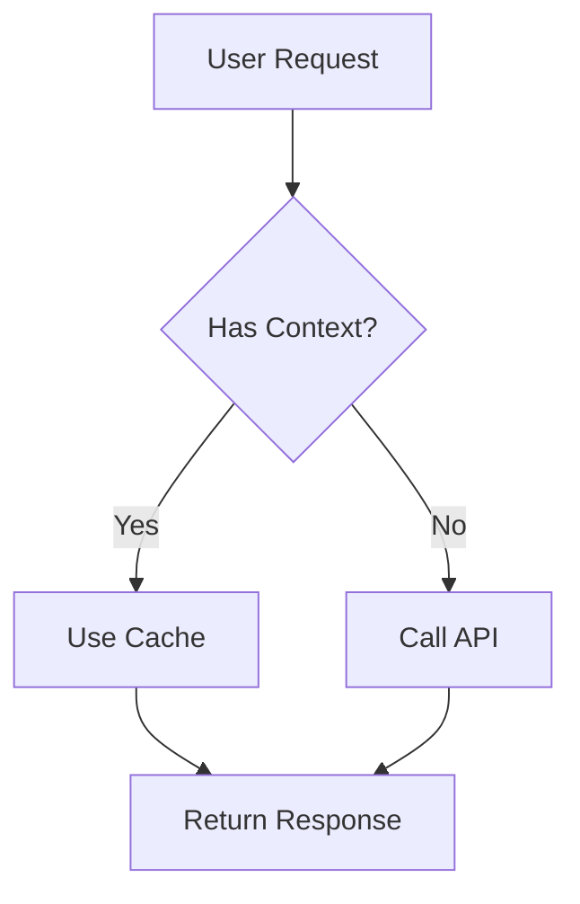
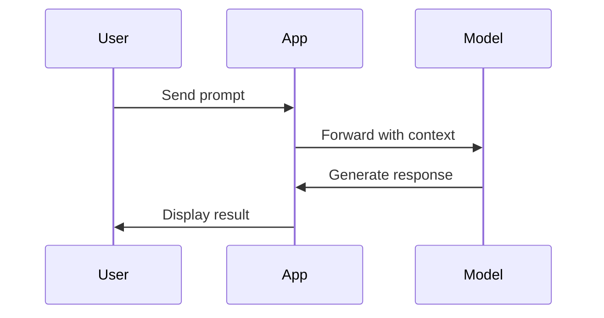
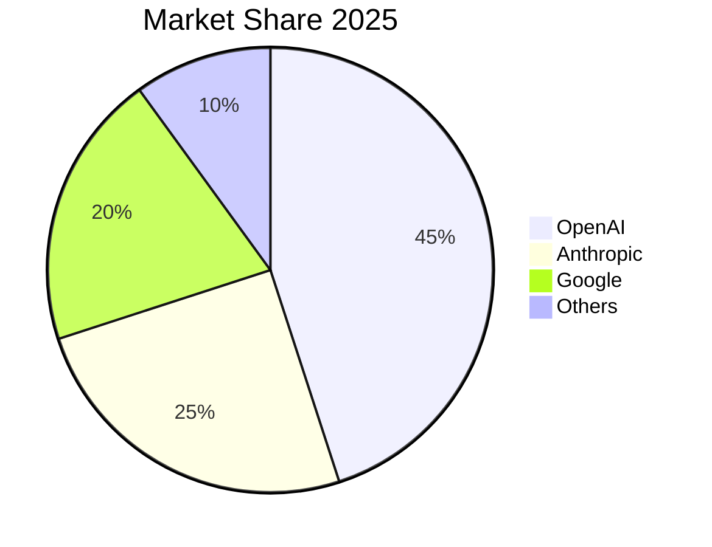
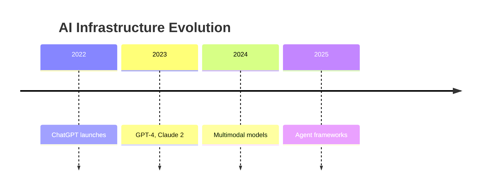
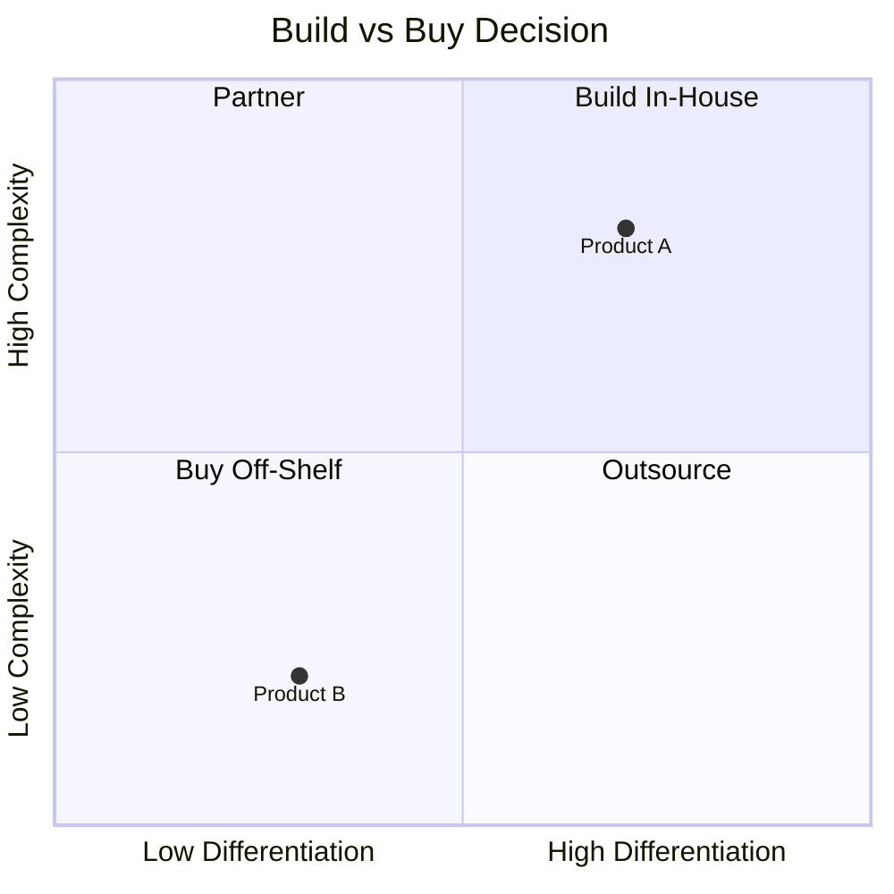
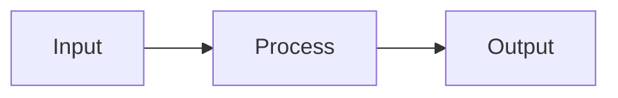

# Formatting Guide

A reference for writing well-formatted articles on this site. These techniques improve readability and help readers navigate complex topics.

---

## Quick Reference

| Element | Syntax | Use For |
|---------|--------|---------|
| Term popup | `` | Jargon, acronyms, technical terms |
| Highlight box | `` | Key insights, summaries |
| Collapsible | `` | Optional details, long content |
| Table | Markdown tables | Comparisons, structured data |
| Mermaid diagram | ` ```mermaid ` | Flowcharts, sequences, relationships |
| Interactive chart | `` | Explorable data, hover states |
| Blockquote | `> text` | Quotes, key statements |

---

## Term Popups

Click-to-reveal definitions for terms that need explanation without disrupting flow.

### Basic Usage

```markdown
The  approach reduces hallucinations.
```

Looks up "RAG" in the glossary and shows definition on click.

### Custom Display Text

```markdown
Understanding  is crucial.
```

Shows "context windows" but looks up "context-window" in glossary.

### Inline Definition

```markdown
The  matters.
```

For one-off terms that don't need to be in the glossary.

### Post-Specific Glossary

Add terms in your post's frontmatter:

```yaml
---
title: "My Post"
glossary:
  barbell-thesis: "Value concentrates at extremes while the middle gets squeezed."
  vertical-integration: "Controlling multiple layers of the stack."
---
```

### Global Glossary

Add commonly-used terms to `data/glossary.yaml`:

```yaml
RAG:
  definition: "Retrieval-Augmented Generation - combining LLMs with external knowledge."

inference:
  definition: "Running a trained model to generate outputs, as opposed to training."
```

### When to Use Terms

- **Do use** for: industry jargon, acronyms, concepts readers might not know
- **Don't use** for: common words, terms you explain in the text anyway

---

## Highlight Boxes

Visually distinct callout sections for important content.

### With Title

```markdown

Infrastructure providers and AI labs are vertically integrating.

The middle layer is getting absorbed.

```

### Without Title

```markdown

**TL;DR:** Own the chips or own the customers. Everything else is a footnote.

```

### When to Use Highlight Boxes

- Key takeaways or summaries
- Important warnings or caveats
- Frameworks or mental models
- Actionable checklists

**Don't overuse** - if everything is highlighted, nothing stands out.

---

## Collapsible Sections

Hide optional content that some readers may want to skip.

```markdown

The implementation uses a recursive descent parser with
memoization for performance...

```

### When to Use Collapsibles

- Technical deep-dives in non-technical articles
- Extended examples or code
- Historical context or background
- Methodology explanations

---

## Tables

Use for comparisons and structured data.

### Basic Table

```markdown
| Layer | Examples | Margin |
|-------|----------|--------|
| Grid | NVIDIA, TSMC | 73% |
| Factory | LangChain, Pinecone | 40-60% |
| Appliance | Cursor, Harvey | 70-80% |
```

### Column Alignment

```markdown
| Left | Center | Right |
|:-----|:------:|------:|
| Text | Text   | $100  |
| More | More   | $250  |
```

- `:---` left align
- `:---:` center align
- `---:` right align

### Tables with Rich Content

```markdown
| Company | Status | Signal |
|---------|--------|--------|
| **Weights & Biases** | Acquired ($1.7B) | Infrastructure absorbs factory |
| Humanloop | d | Labs absorb factory |
| LangChain | Independent | 78x revenue multiple |
```

Tables support bold, links, and term popups inside cells.

### Table Best Practices

- Keep tables simple (3-5 columns max)
- Use bold for row headers when needed
- Right-align numbers for easy comparison
- Consider a highlight box for single-row "key facts"
- For complex data, consider a chart instead

### When Tables Don't Work

If your table has:
- More than 5 columns → split into multiple tables or use a chart
- Long text in cells → use a list or prose instead
- Hierarchical data → use nested lists or a diagram

---

## Charts & Diagrams

Three options depending on complexity and interactivity needs.

### Option 1: Mermaid Diagrams (Built-in)

Best for: flowcharts, sequences, simple visualizations. Renders automatically.

#### Flowchart

````markdown

````

#### Sequence Diagram

````markdown

````

#### Pie Chart

````markdown

````

#### Timeline

````markdown

````

#### Quadrant Chart

````markdown

````

**Mermaid reference:** https://mermaid.js.org/syntax/flowchart.html

---

### Option 2: Static Images

Best for: complex charts, branded visuals, charts from other tools.

```markdown

```

**Creating static charts:**
- Use tools like Figma, Excalidraw, or Python (matplotlib/seaborn)
- Export as PNG with transparent or matching background
- Place in `static/images/post-name/`
- Always include descriptive alt text

**Best practices:**
- Use consistent colors across posts
- Export at 2x resolution for retina displays
- Keep file sizes reasonable (<500KB)

---

### Option 3: Interactive Charts (Embedded Apps)

Best for: explorable data, hover states, animations, complex interactivity.

Interactive charts require creating a standalone HTML file with JavaScript.

#### Step 1: Create the chart file

Create `static/apps/my-chart.html`:

```html
<!DOCTYPE html>
<html>
<head>
  <script src="https://cdn.jsdelivr.net/npm/chart.js"></script>
  <style>
    body { margin: 0; background: transparent; }
    #chart { max-width: 100%; }
  </style>
</head>
<body>
  <canvas id="chart"></canvas>
  <script>
    new Chart(document.getElementById('chart'), {
      type: 'bar',
      data: {
        labels: ['Grid', 'Factory', 'Appliance'],
        datasets: [{
          label: 'Market Size ($B)',
          data: [200, 30, 15],
          backgroundColor: ['#4a9eff', '#ff6b6b', '#4ecdc4']
        }]
      },
      options: {
        responsive: true,
        plugins: {
          legend: { labels: { color: '#fff' } }
        },
        scales: {
          x: { ticks: { color: '#fff' } },
          y: { ticks: { color: '#fff' } }
        }
      }
    });
  </script>
</body>
</html>
```

#### Step 2: Embed in your post

```markdown

```

#### Interactive Chart Libraries

| Library | Best For | Size |
|---------|----------|------|
| [Chart.js](https://chartjs.org) | Simple charts, small footprint | 60KB |
| [D3.js](https://d3js.org) | Custom visualizations, full control | 250KB |
| [Plotly](https://plotly.com/javascript/) | Scientific charts, 3D | 3MB |
| [Apache ECharts](https://echarts.apache.org) | Complex dashboards | 800KB |

#### When to Use Interactive

- Data that benefits from hover/tooltip exploration
- Time series with zoom/pan
- Comparisons where users want to filter
- Animations that tell a story

#### When NOT to Use Interactive

- Simple comparisons (use a table)
- Static relationships (use Mermaid)
- One-time reference (use static image)
- Mobile-first audience (interactions are harder on touch)

---

### Chart Decision Guide

```
Is the data simple (< 5 items)?
├── Yes → Use a TABLE
└── No ↓

Is it a flow, process, or relationship?
├── Yes → Use MERMAID
└── No ↓

Does it need interactivity (hover, zoom, filter)?
├── Yes → Use EMBEDDED APP (Chart.js, D3, etc.)
└── No → Use STATIC IMAGE
```

---

## Text Formatting

### Emphasis Hierarchy

```markdown
**Bold** - Key terms, important points
*Italic* - Emphasis, introducing new terms
`code` - Technical terms, file names, commands
```

### Lists

Use bullet lists for unordered items:
```markdown
- First point
- Second point
- Third point
```

Use numbered lists for sequences or rankings:
```markdown
1. First step
2. Second step
3. Third step
```

### Blockquotes

For quotes or key statements:
```markdown
> Own the chips or own the customers. Everything else is a footnote.
```

For attributed quotes:
```markdown
> "The early idea that models could be moats has been resoundingly defeated."
> — Nathan Lambert
```

---

## Document Structure

### Headings

```markdown
## Major Section        (H2 - main sections)
### Subsection          (H3 - within sections)
#### Minor heading      (H4 - rarely needed)
```

- Use H2 for main sections (these appear in Table of Contents)
- Use H3 for subsections
- Avoid H4+ unless truly necessary

### Section Breaks

Use horizontal rules sparingly to separate major thought transitions:

```markdown
Content about one topic...

---

Content about a different topic...
```

### Opening

Start with a hook - a bold claim, question, or key insight:

```markdown
> ***Own the chips or the customers. Everything else is a footnote.***

---

## The Consensus Is Wrong

The AI infrastructure buildout is $400B annually...
```

---

## Images

### With Alt Text

```markdown

```

Write alt text that describes what the image communicates, not just what it contains.

### Diagrams

For simple diagrams, consider Mermaid:

````markdown

````

---

## Links

### Inline Links

```markdown
According to [a16z's analysis](https://example.com), the market is shifting.
```

### Reference-Style Links

For repeated links or cleaner prose:

```markdown
The [OpenRouter study][openrouter] shows interesting patterns.

[openrouter]: https://openrouter.ai/research
```

---

## Example: Well-Formatted Section

```markdown
## What Survives the Collapse

**Three categories maintain pricing power:**

**1. Infrastructure suppliers with manufacturing moats**

NVIDIA and TSMC maintain 73% gross margins through complexity and
ecosystem lock-in. Cheap training doesn't mean cheap  at scale.

**2. Vertical specialists with domain moats**

Harvey, Abridge, ElevenLabs. Regulatory complexity and proprietary
data create barriers labs can't easily cross.

**3. Embedded platforms with **

Databricks at $62B. Once your data lives there, switching costs compound.


Ask yourself:

1. **Manufacturing moat?** Physical complexity that takes years to replicate.
2. **Regulatory moat?** Domain expertise where compliance is the product.
3. **Data gravity?** Are you the system of record?

If you can't answer yes to at least one, you're building a feature—not a company.

```

---

## Checklist Before Publishing

- [ ] Frontmatter complete (title, date, tags, summary)
- [ ] Opening hooks the reader
- [ ] Technical terms have  popups where helpful
- [ ] Key insights in highlight boxes (1-2 per post max)
- [ ] Tables used for comparisons
- [ ] Images have descriptive alt text
- [ ] Links work and add value
- [ ] Read aloud to check flow
