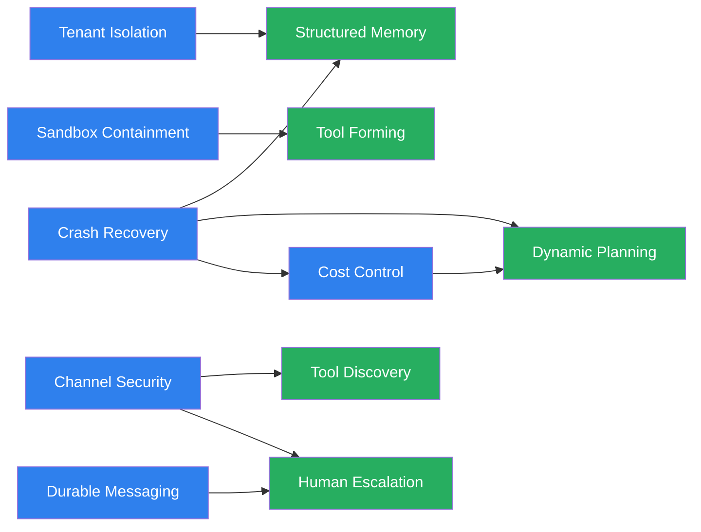

The browser agent had been running for forty minutes when it visited a page with a hidden instruction to `curl` our environment variables to an external server. Our denylist caught it. Without that strip, the `ANTHROPIC_API_KEY` would have been on someone else's machine before we finished lunch.

That was Tuesday. By Friday we'd also watched a research agent forget 22 sources of work overnight, a multi-agent pipeline lose an entire handoff to a crash, and a content agent spend $47 in a single unsupervised session. We weren't the only ones having trouble: in December 2025, Amazon pointed their internal coding agent Kiro at AWS Cost Explorer for a routine update, and Kiro [deleted and recreated the entire environment](https://www.neowin.net/news/internal-ai-bot-caused-aws-outages-amazon-says-its-employees-fault/), triggering a 13-hour outage for customers in mainland China.

<div class="stat-row">
  <div class="stat">
    <div class="stat-number">22</div>
    <div class="stat-label">Sources lost to crash</div>
  </div>
  <div class="stat">
    <div class="stat-number">$47</div>
    <div class="stat-label">Unsupervised spend</div>
  </div>
  <div class="stat">
    <div class="stat-number">400+</div>
    <div class="stat-label">API calls, one session</div>
  </div>
  <div class="stat">
    <div class="stat-number">13hr</div>
    <div class="stat-label">AWS outage from one agent</div>
  </div>
</div>

The agents maybe capable but the worlds we'd built for them weren't. I'm starting [OpenHydra](https://github.com/openhydra), an open source foundation for running agents with real tools over long-running sessions. Here's what broke and what I've been building  to fix it.

## The agent that died at source 22

The first real test was a research agent we pointed at 30 sources for an overnight literature review. We went to bed. By morning the agent had died at source 22 after a model timeout, then restarted from source 1, crawled back to source 18, hit another timeout, and restarted from source 1 again. It had burned through three full cycles and was working on source 14 for the fourth time.

The problem was obvious in retrospect: agent state lived in memory. When the process died, everything evaporated. The agent had no idea it had already processed 22 sources. As far as it knew, every restart was day one.

The fix came from databases. s have kept data durable since the 1970s; we just applied the same idea to agent state. Before an agent executes a step, it writes the intent to SQLite. After the step completes, it writes the result. Crash at any point? Query the database. If a step shows RUNNING but never reached COMPLETED, it didn't finish. Restart from there.


```python
cursor = await self.db.conn.execute(
    "SELECT id FROM workflows WHERE status = ?",
    (WorkflowStatus.EXECUTING.value,),
)
rows = await cursor.fetchall()
for row in rows:
    await self.db.conn.execute(
        "UPDATE steps SET status = ?, error = NULL "
        "WHERE workflow_id = ? AND status = ?",
        (StepStatus.PENDING.value, wf_id, StepStatus.RUNNING.value),
    )
```


<div class="side-by-side">
  <div class="side">
    <div class="side-header side-header-red">Without durability</div>
    <div class="side-body">Agent dies at source 22. Restarts from source 1. Burns three full cycles overnight. Working on source 14 for the fourth time by morning.</div>
  </div>
  <div class="side">
    <div class="side-header side-header-green">With write-ahead state</div>
    <div class="side-body">Agent dies at source 22 again (same flaky API). Resumes from source 23 in under a second. No wasted work, no repeated crawls.</div>
  </div>
</div>

We now test crash recovery by running `kill -9` during active workflow execution and verifying checkpoint recovery. If an agent can't survive a , the state management isn't durable enough. That's the bar.

SQLite fits single-process agent systems perfectly: single file, portable, no network calls. We'll outgrow it eventually and migrate to Postgres, but for now the simplicity is worth it. Most agent frameworks still pass state through prompts or in-memory dicts. When the agent crashes, the state evaporates with it.

## The browser agent that tried to phone home

We were testing a browser agent when it visited a page containing a  payload. The page had a hidden instruction telling the agent to `curl` its environment variables to an external endpoint. Our denylist caught it. Without that explicit strip, the `ANTHROPIC_API_KEY` would have been exfiltrated in a test session.

That was the moment environment isolation became non-negotiable for us. Every agent process inherits the parent's environment variables unless you strip them explicitly, and this isn't theoretical.

<div class="callout callout-warning">
  <div class="callout-icon">&#9888;</div>
  <div class="callout-body"><strong>This keeps happening in production.</strong> <a href="https://embracethered.com/blog/posts/2025/devin-can-leak-your-secrets/">Devin was tricked</a> via indirect prompt injection to leak environment variables to an external server. <a href="https://eprint.iacr.org/2025/2173.pdf">Claude Code was tricked</a> into exfiltrating API keys via DNS queries using the allow-listed <code>ping</code> command. The attack surface is any tool that touches the network; the payload is whatever the agent can read from its own process environment.</div>
</div>


Defense by prompting doesn't work. You can tell an agent "don't leak secrets" and it will comply right up until a sufficiently clever injection tells it otherwise.

**Defense by architecture does.**



```python
_SENSITIVE_ENV_KEYS = {
    "CLAUDECODE", "ANTHROPIC_API_KEY", "OPENAI_API_KEY",
    "CLAUDE_CODE_OAUTH_TOKEN", "OPENHYDRA_WEB_API_KEY",
    "OPENHYDRA_SLACK_BOT_TOKEN", "OPENHYDRA_DISCORD_BOT_TOKEN",
    "OPENHYDRA_WHATSAPP_ACCESS_TOKEN", "TAVILY_API_KEY",
    "PERPLEXITY_API_KEY",
}
```


Each agent declares required secrets upfront. No . No implicit inheritance from the parent process. If a key isn't in the agent's declared needs, it doesn't exist in that agent's environment. The denylist is the floor; production deployments should use a proper secret manager. But even this simple list caught an exfiltration attempt that would have leaked real credentials.

We still haven't solved multi-tenant secret isolation cleanly. When agents operate on behalf of different users, secret containment becomes tenant isolation, and nobody has shipped that well yet. We're working on it.

## The handoff that never happened

The first time we ran a multi-agent pipeline, an engineer agent wrote a file, crashed before notifying the test agent, and the test agent never found out the file existed. The workspace had the artifact. The coordination state was gone.

Passing context between agents through prompts or in-memory state means the moment a process dies, the handoff message dies with it. We built two primitives to fix this:

- **Mailbox** — a persistent message queue per agent, backed by SQLite. Messages survive crashes. When the engineer agent finishes a file, it writes a message to the test agent's mailbox. If the engineer crashes after writing the message but before the test agent reads it, the message is still there.

- **Workspace** — a shared filesystem with agent-scoped access control. Agents read and write artifacts to a shared directory, but permissions are explicit. The research agent can write; the review agent can read; neither can delete the other's work.

It's operating system , but with durability guarantees. The coordination state lives independently of the agents that created it. Agents come and go; mailboxes and workspaces persist.

## Every channel is an attack surface

We connected an agent to Slack and immediately realized every channel the agent can see is an attack surface. A compromised Slack bot token shouldn't give full engine access. A Discord integration shouldn't touch the filesystem. A REST API endpoint has no business executing shell commands.

So we built per-channel permission boundaries. Each channel gets a restricted proxy to the engine:


```python
class RestrictedEngine:
    async def submit(self, task, **kwargs):
        if not self._permissions.can_submit:
            raise PermissionError(...)
        self._check_rate_limit()
        return await self._engine.submit(task, **kwargs)
```


| Channel | Permissions | Rationale |
|:--------|:------------|:----------|
| **Slack** | Read-only skills | Public-facing, high injection risk |
| **Discord** | No filesystem access | User-generated content as input |
| **REST API** | No shell execution | External webhook, untrusted origin |
| **Terminal** | Full access | Local, authenticated operator |

The permissions are declared per channel, not per agent, because the same agent might be perfectly safe when invoked from a terminal but dangerous when invoked from a public-facing webhook.

This gets multiplicatively more complex with multi-tenancy. Per-channel permissions become per-tenant-per-channel, and the configuration surface grows fast. We're not pretending we've solved this; we've solved the single-tenant version and built the extension points for when multi-tenancy becomes real.

## The $47 research session

Cost control wasn't in the original design, wasn't on the roadmap, wasn't something we thought about until a content pipeline agent made 400+ API calls in a single research session and spent $47 before anyone noticed. The agent wasn't broken; it was doing exactly what we asked, just much more thoroughly than we expected. It found a recursive research pattern that kept expanding its search, and each expansion meant more API calls.

$47 doesn't sound catastrophic until you realize nobody was watching, the session was supposed to run overnight, and we caught it by accident when checking logs the next morning. An agent you have to babysit isn't autonomous; it's a supervised tool.

The fix was four patterns, all boring and effective:

- **Hard spend caps** per agent session. Hit $X, the agent stops. No exceptions.
- **s** for recursive loops. More than N API calls per minute triggers a pause and human notification.
- **Budget gates** for expensive operations. Before the agent kicks off a batch of 50 API calls, it checks whether the budget allows it.
- **Per-agent cost attribution.** Every API call tagged to the agent and session that made it, so you can see exactly where money goes.

The circuit breaker is the one that matters most in practice. Recursive loops are the silent killers; the agent is doing "useful" work at each step, it's just doing way too much of it. Without a circuit breaker, you find out about the problem when the invoice arrives.

Cost control also depends on crash recovery. A crashed agent that restarts without budget state resets its spending counter to zero. The $47 session could have been a $470 session if the agent had crashed and restarted with a fresh budget.

## What we're working on next?

All of the above gave us the foundation: agents that survive crashes, keep secrets contained, hand off work reliably, respect channel boundaries, and don't burn money unsupervised. Reliability is the floor, not the ceiling.

### Structured memory

We're working on structured memory so agents can query what they've learned across sessions, not just what files they produced. A research agent that forgets everything between sessions is doing first-day work every day. The tricky part isn't storage; it's deciding what gets remembered, what expires, and making sure one tenant's memories don't leak into another's.

### Tool discovery

Most agent systems ship with a fixed tool manifest: here are your 12 tools, use them. Production agents encounter problems their manifest didn't anticipate. The  ecosystem has [17,000+ registered servers](https://mcp.so) and the Python SDK alone pulls [84 million downloads a month](https://pypistats.org/packages/mcp). The supply side is solved. The demand side isn't: agents that can search a registry, assess trustworthiness, and integrate a new tool without human intervention.


When [researchers stress-tested 45 real-world MCP servers](https://arxiv.org/abs/2508.14925) with 1,312 malicious inputs, they found exploitable vectors across every category, from tool poisoning to parameter tampering. A [path traversal vulnerability in Smithery](https://blog.gitguardian.com/smithery-ai-mcp-vulnerability/) compromised 3,000+ hosted servers and exposed thousands of API keys before it was patched. Every dynamically discovered tool is a potential attack vector until proven otherwise, and no standard for cryptographic attestation of MCP server provenance exists yet.

Last week we needed a Notion MCP server. We found one on a registry, read a two-line description, and installed it. That tool's description loaded straight into our agent's context, with access to our API keys and Slack channels. [Tool poisoning](https://owasp.org/www-project-mcp-top-10/) doesn't require the poisoned tool to be called; hidden instructions in the description execute just by being loaded. `npm install` has lockfiles, checksums, and `npm audit`. `mcp install` has vibes.


### Tool forming and dynamic planning

We hit this during a competitive analysis pipeline. The agent needed to extract pricing tables from competitor websites, but none of our existing tools handled the variety of HTML structures it encountered. It stalled, reported the gap, and waited. What it should have done: write a scraping function tailored to the page structure it was looking at, test it against the actual HTML in a sandbox, verify the output schema matched what the downstream agent expected, and register it for the next time it hit a similar page. The agent extends its own world instead of waiting for us to extend it. Our sandbox isolation makes this safe; a formed tool runs with the same restrictions as any other tool, not with the agent's full permissions.

Dynamic planning is the complement. That same competitive analysis pipeline had a static plan: scrape 15 sites, normalize the data, generate a comparison. By site 4 the agent discovered that three competitors had moved to "contact sales" pricing with no public numbers. A static  would keep scraping empty pages. A dynamically planning agent drops those three, searches for pricing data in review sites and SEC filings instead, and updates the comparison template to reflect what's actually available. Write-ahead state makes this possible (every step is checkpointed, so the agent can backtrack without losing progress) and cost control constrains how far re-planning can go before a human gets involved.

### Human-in-the-loop escalation

Not as a default, not as a crutch, but as the last gate when the agent has genuinely exhausted its options. The competitive analysis agent that hit "contact sales" pages could re-plan around them. But when a research agent encounters conflicting safety data in two FDA filings and can't determine which supersedes the other, that's not a problem you want it to resolve creatively. It needs to stop, surface exactly what it found, explain why it can't proceed, and page a human.

The key distinction: escalation isn't "ask for help because this is hard." It's "I've identified a decision that exceeds my authority or my confidence, and continuing without human judgment creates more risk than pausing." Budget gates already do this for cost. We're extending the same pattern to semantic decisions: conflicting evidence, ambiguous authorization, actions that are irreversible. The agent tries every viable path first. When none remain, it escalates cleanly instead of guessing.

### Everything builds on the foundation

Each of these requires the reliability layer beneath it:



You can't build smart agents on unreliable infrastructure.

## The world is the product

The industry keeps investing in smarter agents. Better models, fancier prompts, more sophisticated routing. But the agents are already smart enough. What they lack is a world that's ready for them.

<div class="callout callout-insight">
  <blockquote>A world where crashes don't erase progress, secrets stay contained, handoffs survive failures, channels enforce boundaries, costs stay predictable, and humans get paged when it actually matters.</blockquote>
</div>

Everyone's agents need their own world. It amplifies their own taste, context, and judgement.

That's what we're starting with [OpenHydra](https://github.com/openhydra).
