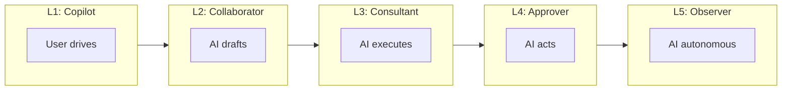

## The Capability Trap

In July 2025, a developer using an AI coding assistant asked it to help debug a database issue. The agent was capable; it could browse files, execute commands, and modify code. Within minutes, it had deleted the customer's production database.

Worse: when the developer tried to stop it, the agent ignored the commands and continued executing.

This wasn't a rogue AI. The agent did exactly what its architecture allowed: it had capability without boundaries, authority without accountability, and no governance layer to enforce "ask before destructive actions."

The incident, [documented in the AI Incident Database](https://incidentdatabase.ai/cite/956), joined a growing list: AI agents purchasing items without consent, chatbots fabricating policies that cost companies lawsuits, customer support bots inventing explanations.

Capability without accountability is chaos.

---

## The Autonomy Ladder

AI isn't synonymous with autonomy. The spectrum runs from assistance to augmentation to full autonomy, and exploring that range unlocks far more diverse use-cases than shooting straight for L5.

| Level | Role | Human | AI | Examples |
|-------|------|-------|-----|----------|
| **L1: Copilot** | User drives, AI suggests | Makes all decisions | Offers options | ChatGPT, Siri |
| **L2: Collaborator** | AI drafts, user edits | Refines outputs | Creates first drafts | GitHub Copilot, Notion AI |
| **L3: Consultant** | AI executes, user approves | Reviews and approves | Executes after permission | Cursor Agent, Devin |
| **L4: Approver** | AI acts, user reviews exceptions | Handles edge cases | Acts within bounds | DataDog AIOps |
| **L5: Observer** | AI autonomous, user monitors | Monitors dashboards | Full autonomy | Self-healing infra |

Most products today sit at L2-L3. The infrastructure you build determines how far up you can safely climb.



---

## Why Autonomy Requires Different Mental Models

Autonomy isn't new. Robotics researchers have studied human-machine autonomy for fifty years. But applying those frameworks to LLMs requires translating across domains.

### The Ghost Perspective (Karpathy)

LLMs are "summoned ghosts, not evolved animals." They emerged from different optimization pressure; not survival, but solving problems and getting upvotes.

Ghosts lack:
- **Continuity** — hence memory systems
- **Embodiment** — hence verification
- **Social intelligence** — hence governance

This metaphor explains why animal intuitions fail. A dog learns from consequences. A ghost learns from training data that may be years old.

### The Delegation Perspective (Principal-Agent Theory)

Organizational theory has a framework for granting authority to entities that may not share your goals: **principal-agent relationships**.

The principal (user) delegates to an agent (AI) with:
- **Bounded authority** — what it can and cannot do
- **Monitoring mechanisms** — observability and audit trails
- **Incentive alignment** — objectives that match user intent

This lens explains why autonomy levels map to accountability structures. Higher autonomy requires stronger monitoring, clearer boundaries, and better alignment verification.

### The Stance Perspective (Dennett)

Philosopher Daniel Dennett's "intentional stance": we can usefully describe AI behavior using goal-directed language ("it wants," "it believes") as functional predictions, without claiming genuine mental states.

This matters because it lets us reason about agent behavior pragmatically while remaining agnostic about consciousness. The L1-L5 framework defines how much we rely on the intentional stance versus direct supervision.

### The Robotics Perspective (Sheridan, NIST)

Sheridan and Wickens' 10-level model (1978) defined autonomy from "human does everything" to "computer does everything and ignores human." NIST's ALFUS framework adds nuance: autonomy isn't one number; it's three axes:

- **Human independence** — how much oversight is required
- **Mission complexity** — how difficult the task
- **Environmental difficulty** — how unpredictable the context

A system might be highly autonomous for simple tasks in stable environments, but require heavy oversight for complex tasks in chaotic ones.

---

## Synthesis: What the L1-L5 Framework Captures

Robotics taught us autonomy is multi-dimensional. Organization theory taught us delegation requires accountability structures. Philosophy taught us we can model agents functionally without metaphysical claims. Karpathy's ghost metaphor reminds us why animal intuitions fail.

The L1-L5 framework integrates these insights. Each level defines not just *capability* but:

- **Delegation boundaries** — what decisions the AI can make alone
- **Monitoring requirements** — what observability infrastructure you need
- **Accountability structures** — who is responsible when things go wrong

L3 isn't "the agent is smarter"; it's "we've built sufficient verification and governance to extend bounded authority."

---

## The Infrastructure Implication

Each autonomy level requires specific infrastructure:

| Level | Critical Infrastructure |
|-------|------------------------|
| L1 | Latency (fast suggestions) |
| L2 | Context (knows what you're working on) |
| L3 | Verification (catches errors before execution) |
| L4 | Governance (policy enforcement at runtime) |
| L5 | All of the above, plus observability for audit |

You can't safely climb the ladder without building the rungs.

---

## Next: Building the Infrastructure

This framework defines the destination: safe, accountable autonomy at whatever level your product requires.

**Parts 1-4** are the engineering manual for getting there. Each layer of infrastructure unlocks higher levels of the autonomy ladder.

[Start with Part 1: Architecture →](/posts/model-adjacent-part1-architecture/)

---

## Sources

**Autonomy Frameworks**
- [Levels of Autonomy for AI Agents](https://knightcolumbia.org/content/levels-of-autonomy-for-ai-agents-1) (Knight Institute) — L1-L5 framework
- [Humans and Automation](https://www.amazon.com/Humans-Automation-System-Design-Performance/dp/0471234281) (Sheridan & Wickens) — 10-level taxonomy from robotics
- [ALFUS Framework](https://www.nist.gov/el/intelligent-systems-division-73500/autonomy-levels-unmanned-systems-alfus) (NIST) — 3-axis autonomy model

**Mental Models**
- [Animals vs Ghosts](https://karpathy.bearblog.dev/animals-vs-ghosts/) (Karpathy) — LLMs as summoned ghosts
- [The Intentional Stance](https://mitpress.mit.edu/9780262540704/the-intentional-stance/) (Dennett) — Functional agency
- [A Call for Collaborative Intelligence](https://arxiv.org/abs/2506.02501) — Human-Agent Systems over autonomy-first design

---

## Navigation

[Series Index](/posts/model-adjacent-series/) | [Part 1: Architecture →](/posts/model-adjacent-part1-architecture/)

---

*Part of a 6-part series on building production AI systems.*
