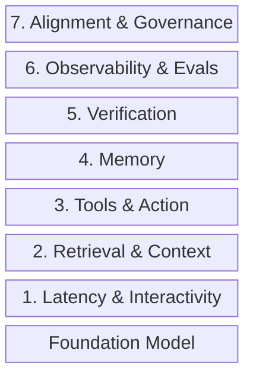
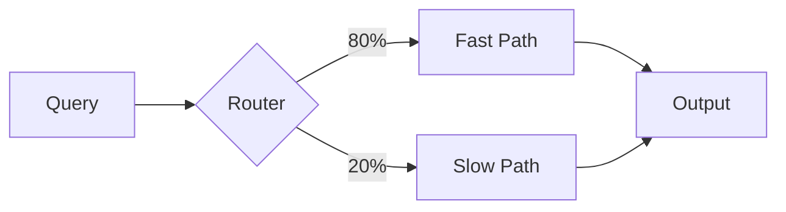

## Why Speed Matters

At L1 (copilot), the human drives. They can tolerate a slow AI; it's just making suggestions. At L3 (consultant), the AI executes and the human approves. If that approval window takes 3 seconds to render, the human disengages. By L4, slow means unsafe.

Latency isn't a nice-to-have. It's the difference between a tool that augments and one that frustrates into abandonment.

This part covers the physics: making AI fast enough that humans stay engaged, and trust it enough to delegate.

---

Think of the foundation model as the CPU; your product is the computer you build around it.

A CPU without memory, I/O, and an OS is useless. Same for a foundation model without context management, tool orchestration, and verification. Model-adjacent infrastructure turns stochastic text generation into shippable software.

---

## The Stack

Seven layers make up the model-adjacent stack; lower layers (1-3) enable capability. Upper layers (5-7) gate trust. You can't safely increase autonomy without investing in both.



<details>
<summary>Text description of diagram</summary>

Vertical stack diagram showing 8 layers of model-adjacent architecture, from bottom to top: Foundation Model (base), Layer 1: Latency & Interactivity, Layer 2: Retrieval & Context, Layer 3: Tools & Action, Layer 4: Memory, Layer 5: Verification, Layer 6: Observability & Evals, Layer 7: Alignment & Governance. Lower layers (1-3) enable capability. Upper layers (5-7) gate trust.

</details>

**Layers 1-3** determine what's possible. Latency keeps humans in the loop. Retrieval reduces hallucination. Tool permissions create hard boundaries.

**Layers 5-7** determine what's safe. Verification gates autonomous execution. Observability enables audit trails. Governance defines the ceiling.

---

## Latency Engineering

Classic SaaS tolerated 200ms response times. Model-adjacent products need sub-50ms perceived latency, or immediate streaming.

### Fast-Path / Slow-Path

Route most requests through a fast path. Reserve expensive reasoning for the tail.





<details>
<summary>Text description of diagram</summary>

Left-to-right flowchart showing request routing. Query enters a Router which splits traffic: 80% goes to Fast Path, 20% goes to Slow Path. Both paths converge to Output. Fast path uses cache plus small model. Slow path requires retrieval plus large model plus tools.

</details>

Most requests hit cache + small model. 20% need retrieval + large model + tools.

### Latency Budget (500ms target)

| Stage | Budget |
|-------|--------|
| Routing | 30ms |
| Cache lookup | 10ms |
| Retrieval | 80ms |
| Model (TTFT) | 200ms |
| Safety check | 50ms |
| Tools | 100ms |
| Buffer | 30ms |

Track p50 and p99 separately. Tail latency is where users churn.

### Techniques

**Streaming.** Show partial tokens. Users tolerate longer waits when they see progress.

**Speculative decoding.** Draft model proposes, target model verifies batches. vLLM with Eagle 3 achieves **2.5x inference speedup** and **1.8x latency reduction** in memory-bound scenarios (low request rates). Benefits diminish at high throughput without workload-specific tuning; test your actual traffic pattern.

**Two-pass generation.** Fast draft now, refinement later. Let users interrupt if the draft suffices.

**Async tools.** "Let me check that..." with a spinner beats blocking.

### Products

| Product | Why Model-Adjacent |
|---------|-------------------|
| **vLLM** | PagedAttention requires understanding KV cache memory patterns |
| **TensorRT-LLM** | Kernel fusion, quantization requires compute graph knowledge |
| **llama.cpp** | INT4/INT8 without quality loss requires weight distribution knowledge |
| **Fireworks AI** | Draft/verify pattern requires understanding token prediction |

---

## Token Economics

Tokens translate directly to compute, latency, and cost; manage them like CPU and memory budgets.

### Prompt Structure

Prompt caching rewards stable prefixes:

```
STABLE:       System instructions, tool defs, examples
SEMI-STABLE:  Retrieved context, user preferences
VARIABLE:     Current conversation, query
```

Put stable content first. Cache hit rates go from 0% to 70%+.

### Cost Impact

| Structure | Cache Rate | Cost/1K requests |
|-----------|------------|------------------|
| Bad (variable first) | 0% | $12.00 |
| Good (stable first) | 70% | $4.80 |
| Optimal (prefix sharing) | 85% | $2.70 |

### Context Compaction

Long conversations accumulate tokens. After N turns: summarize into structured facts, drop raw history, keep last 2-3 turns.

**Before:** `[System] + [20 turns] = 12,000 tokens`
**After:** `[System] + [Facts] + [3 turns] = 3,000 tokens`

### Token SLOs

Establish Service Level Objectives for cost and latency:

- **p95 latency target** per request type (e.g., <500ms for chat, <2s for analysis)
- **Cost-per-request ceiling** by feature (e.g., $0.01 for suggestions, $0.05 for generation)
- **Cache hit rate floor** (e.g., >70% for prompt cache)

Breaches trigger alerts or automated fallbacks to smaller models. Track per user/feature for attribution.

### Products

| Product | Why Model-Adjacent |
|---------|-------------------|
| **Anthropic Prompt Caching** | Requires understanding attention computation reuse |
| **SGLang** | Radix attention, prefix sharing requires tree-structured attention knowledge |
| **Martian / Not Diamond** | Routing requires understanding model capability boundaries |

---

## Sources

**Latency & Serving**
- [Efficient Memory Management for LLMs with PagedAttention](https://arxiv.org/abs/2309.06180) (vLLM)
- [Fast Inference via Speculative Decoding](https://arxiv.org/abs/2211.17192)
- [TensorRT-LLM](https://github.com/NVIDIA/TensorRT-LLM)

**Token Economics**
- [Prompt Caching](https://docs.anthropic.com/en/docs/build-with-claude/prompt-caching) (Anthropic)
- [SGLang: Efficient Execution](https://arxiv.org/abs/2312.07104)

**2025-2026 Updates**
- [Faster Inference with vLLM & Speculative Decoding](https://developers.redhat.com/articles/2025/07/01/fly-eagle3-fly-faster-inference-vllm-speculative-decoding) (Red Hat, 2025) — Eagle 3 benchmarks
- [AI Agent Landscape 2025-2026](https://tao-hpu.medium.com/ai-agent-landscape-2025-2026-a-technical-deep-dive-abda86db7ae2) (Tao An) — Context compaction patterns

---

## What's Next

Latency and token economics are the physics. They determine what's *possible*. But physics alone doesn't create memory or capability.

**Part 2** tackles memory (and the cost of forgetting) and tools (and the cost of breaking things).

---

## Navigation

[← Part 0: The Autonomy Ladder](/posts/model-adjacent-part0-autonomy-ladder/) | [Series Index](/posts/model-adjacent-series/) | [Part 2: Context & Tools →](/posts/model-adjacent-part2-context-tools/)

---

*Part of a 6-part series on building production AI systems.*
