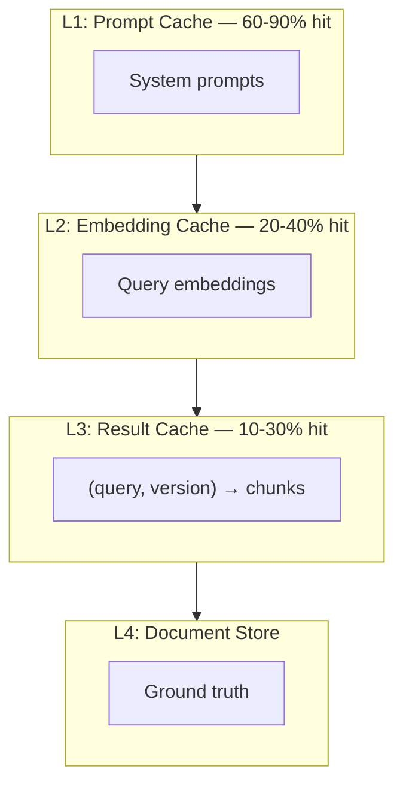
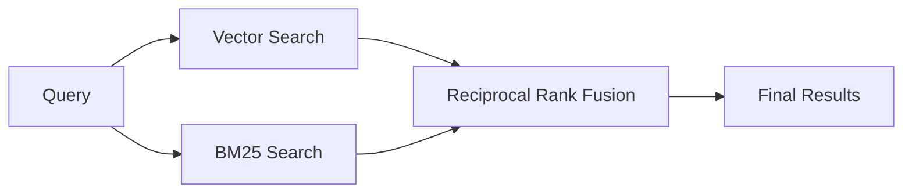

## The Goldfish Problem

A model without memory is a goldfish; every conversation starts from zero, every user a stranger. A model without tools is a brain in a jar, capable of thought but incapable of action. Part 1 made the model fast; this part gives it memory and hands. But memory that hallucinates is worse than no memory. Tools without permissions are security holes. Most products fail here, not from lack of capability, but from lack of discipline.

---

Retrieval, memory, and tool systems define what the model knows and what it can do. Get these wrong and the model hallucinates or fails silently.

---

## Retrieval Systems

RAG is not "add a vector database." It's a cache hierarchy with freshness policies and provenance.

### Cache Hierarchy



Each level trades freshness for speed. Make these tradeoffs explicit.

### Freshness SLAs

| Source | Max Staleness | Trigger |
|--------|---------------|---------|
| Support tickets | 5 min | Webhook |
| Product docs | 4 hours | Git push |
| Policies | 24 hours | Manual publish |
| Historical data | 7 days | Batch job |

### Hybrid Retrieval

Vector search misses keyword matches. Keyword search misses semantic similarity. Use both.



The reranker is where quality is won or lost.

### Decoupled Retrieval (2025 Pattern)

Separate **search** from **retrieve**:

- **Search stage:** Small chunks (100-256 tokens) maximize recall during initial lookup
- **Retrieve stage:** Larger spans (1024+ tokens) provide sufficient context for comprehension

This mirrors how humans research: scan many sources quickly, then read deeply.

### Retrieval Design Trade-offs

| Design | When It Shines | Failure Modes |
|--------|---------------|---------------|
| Vector (HNSW) | Unstructured semantic search | Misses exact matches; embedding drift |
| Hybrid (BM25+Vector) | Mixed keyword + semantic | Higher latency; reranker costs |
| GraphRAG | Entity/relationship Q&A | Schema governance overhead |
| Tool Retrieval Index | Agent tool selection at scale | Tool sprawl; index staleness |

### Products

| Product | Why Model-Adjacent |
|---------|-------------------|
| **Cohere Rerank** | Attention over query-document pairs |
| **Voyage AI** | Embedding geometry optimization |
| **Jina AI** | Token-level similarity (ColBERT) |

---

## Memory Architecture

Memory has become a product category in its own right; users expect AI to remember. They also expect control.

### Three Types

**Episodic:** What happened, when. "Last week you asked about refund policies."

**Semantic:** Stable facts. "User's company is Acme Corp."

**Procedural:** How to work with this user. "When user says 'ship it', deploy to staging."

### Compaction

Raw logs grow unbounded. Convert to structured facts periodically.

**Before:** 200 turns, 50KB
**After:** facts + preferences + recent context, 2KB

### User Control (Non-Negotiable)

- View what's remembered
- Correct inaccuracies
- Delete specific memories
- Export data

Regulation increasingly mandates this. Build it in from day one.

### Memory Governance Layer

Enterprise memory architectures now define:

- **Working memory:** Immediate context for current task
- **Episodic memory:** Logs of past sessions and actions
- **Semantic memory:** Consolidated facts and relationships
- **Governance policies:** Who owns memory, how it updates, when it must be forgotten

### Products

| Product | Why Model-Adjacent |
|---------|-------------------|
| **Zep** | Temporal knowledge graphs, entity relationships |
| **Mem0** | Automatic memory extraction from conversations |
| **LangGraph** | Checkpoint/restore for multi-step agents |

---

## Tool Ecosystems

Once agents call real systems, stringly-typed prompt integrations break; tools graduate from convenience features to load-bearing infrastructure.

### MCP: The Protocol Shift

Model Context Protocol makes tools discoverable and self-describing.

**Before:** Every integration is custom code.
**After:** Tools discovered at runtime with typed schemas.

### MCP Industry Status (2026)

MCP has become the "USB-C for AI":

- **5,800+ servers** published, **300+ clients** integrated
- Adopted by **OpenAI** (Agents SDK), **Google** (Gemini), **Microsoft** (VS Code, Copilot), **Salesforce** (Agentforce)
- Donated to Linux Foundation's Agentic AI Foundation (Dec 2025)

Stop building bespoke connectors. The protocol war is over.

### Schema Quality

**Bad:**
```json
{"name": "search", "description": "Search for stuff"}
```

**Good:**
```json
{
  "name": "knowledge_base_search",
  "description": "Search internal docs. Use for policy questions. NOT for real-time data.",
  "parameters": {
    "query": {"type": "string", "minLength": 3},
    "doc_type": {"enum": ["policy", "product", "how-to"]}
  }
}
```

The model will misuse bad schemas.

### Permissions

```yaml
tool: database_query
permissions:
  allowed_tables: [orders, customers]
  denied_columns: [ssn, credit_card]
  rate_limit: 100/hour
```

Log every call: who, what, when, and the prompt context that triggered it.

### Products

| Product | Why Model-Adjacent |
|---------|-------------------|
| **Anthropic MCP** | Typed schemas models can reliably parse |
| **OpenAI Function Calling** | JSON mode requires output constraint knowledge |
| **Toolhouse** | Sandboxing for unpredictable model calls |

---

## Sources

**Retrieval**
- [RAG for Knowledge-Intensive NLP](https://arxiv.org/abs/2005.11401) — Original RAG paper
- [ColBERT: Efficient Passage Search](https://arxiv.org/abs/2004.12832)

**Memory**
- [MemGPT: LLMs as Operating Systems](https://arxiv.org/abs/2310.08560)

**Tools**
- [A Deep Dive Into MCP](https://a16z.com/a-deep-dive-into-mcp-and-the-future-of-ai-tooling/) (a16z)
- [Toolformer](https://arxiv.org/abs/2302.04761)

**2025-2026 Updates**
- [From RAG to Context: 2025 Year-End Review](https://ragflow.io/blog/rag-review-2025-from-rag-to-context) (RAGFlow) — Decoupled pipelines, tool retrieval
- [MCP Enterprise Adoption Guide](https://guptadeepak.com/the-complete-guide-to-model-context-protocol-mcp-enterprise-adoption-market-trends-and-implementation-strategies/) (Gupta, 2025) — 5,800 servers, industry adoption
- [A 2026 Memory Stack for Enterprise Agents](https://alok-mishra.com/2026/01/07/a-2026-memory-stack-for-enterprise-agents/) (Mishra) — Memory tier architecture
- [Why MCP Won](https://thenewstack.io/why-the-model-context-protocol-won/) (The New Stack, 2025)

---

## What's Next

Context and tools give models knowledge and capability. But capability without verification is liability.

Every output is a hypothesis. Every action is a proposal. **Part 3** covers the quality gates that turn proposals into safe executions.

---

## Navigation

[← Part 1: Architecture](/posts/model-adjacent-part1-architecture/) | [Series Index](/posts/model-adjacent-series/) | [Part 3: Quality Gates →](/posts/model-adjacent-part3-quality/)

---

*Part of a 6-part series on building production AI systems.*
