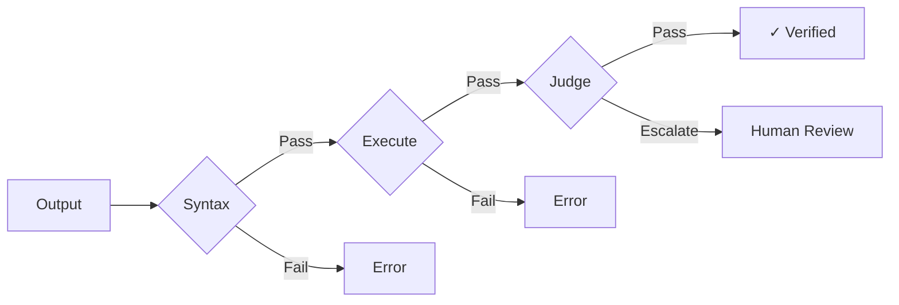

## The Hypothesis Problem

You've built a fast model (Part 1) with memory and tools (Part 2). It now generates answers and takes actions at scale. An uncomfortable truth: every output is a hypothesis. The model doesn't *know* it's right. It's predicting tokens. Sometimes those predictions are brilliant. Sometimes they're confident hallucinations. Your job becomes to tell the difference before users do.

> Model outputs are hypotheses. Verification, observability, and evals determine whether those hypotheses survive production.

## Verifiability

*"Verifiability is to AI what specifiability was to 1980s computing."* — Karpathy

A verifiable environment is resettable (new attempts possible), efficient (many attempts), and rewardable (automated scoring). Models spike in math, code, and puzzles because RLVR applies. They struggle with open-ended creative tasks because there's no clear reward signal.

Your verification infrastructure doesn't just catch errors; it enables capability. The tasks where you build strong verification become the tasks where your product improves.

---

## Verification Pipeline

Treat outputs as proposals to be tested.



### Execution-Based

For code, SQL, or executable output:

```python
def verify_code(code: str, tests: list) -> Result:
    try:
        ast.parse(code)  # Syntax
    except SyntaxError:
        return Result(passed=False, stage="syntax")

    sandbox = Sandbox(timeout=5)
    sandbox.exec(code)  # Execute

    for test in tests:  # Validate
        if not test.passes(sandbox):
            return Result(passed=False, stage="test")

    return Result(passed=True)
```

### LLM-as-Judge

For subjective quality, use a separate model:

```
Evaluate on: Accuracy, Completeness, Clarity, Safety
Score 1-5. Flag issues below 3.
```

### Self-Consistency

For high-stakes decisions, sample multiple times. Disagreement triggers review or voting.

---

## Observability

What you don't measure, you can't improve. What you don't trace, you can't debug.

### Trace Structure

Every request produces a trace:

```json
{
  "trace_id": "tr_abc123",
  "stages": [
    {"name": "routing", "duration_ms": 25},
    {"name": "cache", "result": "hit"},
    {"name": "generation", "tokens": {"in": 1200, "out": 340}}
  ],
  "total_ms": 258,
  "cost_usd": 0.0034
}
```

### What to Track

**Per-request:** Latency by stage, token counts, cache hit/miss, tool calls, safety outcomes.

**Aggregate:** p50/p95/p99 latency, cache hit rates, error rates by type, cost per user/feature.

### The Minimal Viable Stack

1. **Comprehensive Logging** — Capture prompts, contexts, tool calls, responses
2. **Tracing** — Step-level timing and token usage for chains and agents
3. **Evaluation** — Automated scoring (LLM-as-judge or heuristics) against golden sets
4. **Gates** — Block merges if faithfulness or latency SLOs regress

### Drift Detection

Embedding drift tracks semantic shifts in model behavior that traditional metrics miss. Deploy monitors to catch when your model's responses drift from expected distributions.

### Products (2026 Landscape)

| Product | Best For | Notable Features |
|---------|----------|------------------|
| **Braintrust** | Live monitoring + alerts | BTQL filters; tool tracing; cost attribution; AI agents for baseline detection |
| **Arize Phoenix** | Drift + RAG metrics | Advanced embedding drift detection; RAG-specific observability |
| **DeepEval** | LLM unit tests | Pytest-style testing; synthetic data monitoring; CI/CD integration |
| **Langfuse** | Prompt versioning | Token-level cost tracking; open-source option |
| **Helicone** | Full-spectrum observability | User/model interaction journeys; caching; cost attribution |
| **W&B Weave** | Experiment tracking | Evaluations Playground; systematic tests against golden datasets |

---

## Evals

Shipping without evals is shipping without tests.

### Dataset Types

**Golden set:** Hand-curated, known-good answers. Run on every change.

**Regression set:** Previously failed cases. Prevents backsliding.

**Adversarial set:** Jailbreaks, prompt injections, edge cases.

### Evals as CI

```yaml
on:
  push:
    paths: ['prompts/**']

jobs:
  eval:
    steps:
      - run: python eval/run.py --suite golden --threshold 0.95
      - run: python eval/run.py --suite regression --threshold 1.0
      - run: python eval/run.py --suite adversarial --threshold 0.99
```

Prompt changes don't merge without passing evals.

### Products

| Product | Why Model-Adjacent |
|---------|-------------------|
| **Braintrust** | LLM-as-judge with calibration |
| **Patronus AI** | Test case generation from production failures |
| **Galileo** | Factual inconsistency detection |

---

## Sources

**Verification**
- [Verifiability](https://karpathy.bearblog.dev/verifiability/) (Karpathy)
- [Chain-of-Verification](https://arxiv.org/abs/2309.11495) (ACL 2024)
- [Self-Consistency Improves CoT](https://arxiv.org/abs/2203.11171)

**Evals**
- [HELM: Holistic Evaluation](https://arxiv.org/abs/2211.09110)
- [Judging LLM-as-a-Judge](https://arxiv.org/abs/2306.05685)

**2025-2026 Updates**
- [Production RAG in 2025: Evaluation Suites, CI/CD Quality Gates](https://dextralabs.com/blog/production-rag-in-2025-evaluation-cicd-observability/) (Dextralabs) — Golden sets, automated gates
- [Top 10 LLM Observability Tools 2025](https://www.braintrust.dev/articles/top-10-llm-observability-tools-2025) (Braintrust) — Tooling comparison
- [Complete Guide to LLM Observability 2026](https://portkey.ai/blog/the-complete-guide-to-llm-observability) (Portkey) — Guardrails vs evals distinction

---

## What's Next

Verification catches errors. But not all errors are quality problems; some are policy violations.

"Should I help with this?" is different from "Is this answer correct?"

**Part 4** covers governance: the runtime policy layer that defines what the model should and shouldn't do.

---

## Navigation

[← Part 2: Context & Tools](/posts/model-adjacent-part2-context-tools/) | [Series Index](/posts/model-adjacent-series/) | [Part 4: Governance →](/posts/model-adjacent-part4-governance/)

---

*Part of a 6-part series on building production AI systems.*
